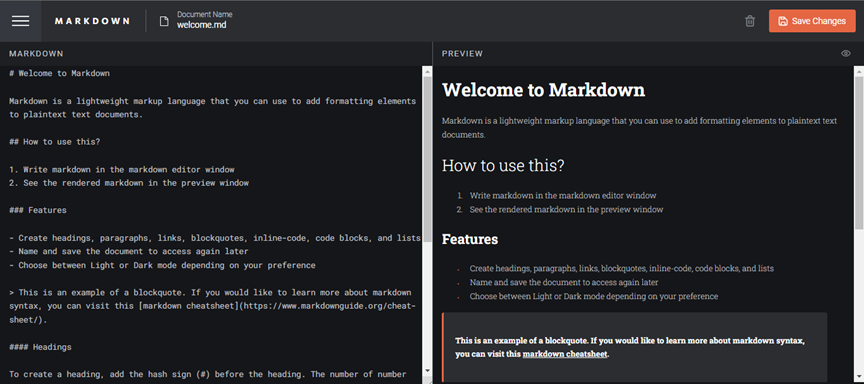

## In-Browser-Markdown Editor

### What is an In-browser markdown editor?

An in-browser Markdown editor is a web-based tool that allows users to write and edit Markdown text directly within a web browser. Markdown is a lightweight markup language with plain text formatting syntax that is often used to write documentation, readme files, and content for websites.

## Importance

- Ease of Use: Markdown editors provide a simple and intuitive way to write formatted text without needing to learn complex formatting syntax. The editor typically supports real-time preview, so users can see how their Markdown will look once rendered.

- Increased Productivity: By integrating Markdown editing directly into the browser, users can quickly create and format documents without switching between different tools or applications.

- No Installation Required: Being web-based, in-browser Markdown editors don’t require any installation or setup. Users can access the editor from any device with a web browser, making it highly accessible.

- Real-Time Preview: It offers live preview features that show a real-time rendering of the Markdown text. This helps users to see the final output as they write, making it easier to format text correctly.

- Accessibility and Portability: Users can access their Markdown editor from any location and device with internet access, which is beneficial for remote work and on-the-go content creation.

## Overview

### Features

Users should be able to:
- Create a new file and start writing.
- Use Markdown syntax to format your content.
- Read, Rename and Update documents.
- View a full-page preview of the formatted content
- View the optimal layout for the app depending on their device's screen size.
- Switch between Dark and Light Modes work environment.
- See hover states for all interactive elements on the page.
- Delete markdown document that is not in use.

### Extra Feature

- Use of localStorage to save the current state in the browser that persists. This means that the data stored in localStorage remains available even after the browser is closed and reopened, as long as the user doesn’t clear their browser data.

### Screenshots

.png)            

.png) 

.png)    

## Tech Stack

- React
- TypeScript
- Markdown-to-JSX
- React-DOM
- User Events
- Styled Components

## To Run the Application:

- Clone the repository
  Then Run:
- npm install  
- npm start
- Open http://localhost:3000 to view it in the browser.

### Links

- My Live Site URL - (https://princehammycode.github.io/In-browser-markdown-editor/)

### Some Useful Links

- [React](https://reactjs.org/)
- [Styled Components](https://styled-components.com/)
- [react-modal](https://www.npmjs.com/package/react-modal#api-documentation)
- [markdown-to-jsx](https://www.npmjs.com/package/markdown-to-jsx)

